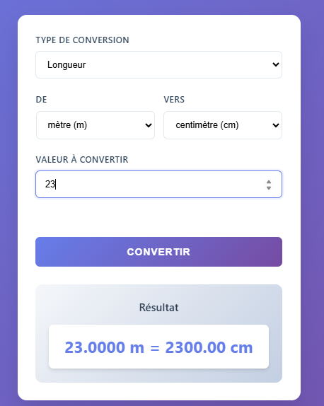

# Unit_Converter

## Description
Application web permettant de convertir différentes unités (longueur, poids, température, etc.) de manière simple et instantanée.  
Ce projet est le **quatorzième** du défi personnel **100 projets en 2026**.

---

## Objectifs du projet
- Mettre en place une logique de conversion
- Manipuler les formulaires et champs de saisie
- Gérer les événements utilisateur
- Renforcer les bases en JavaScript
- Concevoir une interface claire et intuitive

---

## Plateforme
- Web (navigateur)

---

## Technologies utilisées
- HTML
- CSS
- JavaScript 

---

## Fonctionnalités
- Sélection du type de conversion (longueur, poids, température, etc.)
- Saisie de la valeur à convertir
- Conversion instantanée
- Affichage clair du résultat
- Validation basique des entrées

---

## Design & UX
- Interface minimaliste et fonctionnelle
- Carte centrale pour la conversion
- Champs larges et lisibles
- Résultat mis en évidence
- Responsive (mobile et desktop)

---

## Captures d’écran

---

## Ce que j’ai appris
- Gestion des événements (`input`, `change`)
- Structuration de la logique métier
- Manipulation des valeurs numériques
- Amélioration de l’UX avec feedback immédiat

---

## Améliorations possibles
- Ajout de nouveaux types d’unités
- Historique des conversions
- Inversion rapide des unités
- Mode sombre

---

## Statut du projet
 **Projet terminé**
